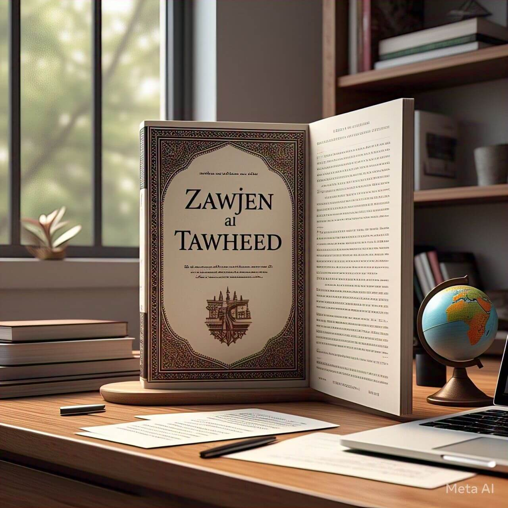

# Welcome to Zawjen
Zawjen is **not** a technical project. It is on a mission to spread `sincerity` the Quran. Its leadership and its governance practices should be aligned with principles of `sincerity` as established by the Quran.

This repository is a collection of documents that defines Zawjen operations and practices.
## About Us

| Section       | Description |
|--------------|------------|
| [Vision](vision/welcome.md) | Define the long-term goals and purpose of the project. |
| [Process](process/welcome.md) | Outline the workflow, methodologies, and development cycle. |
| [Requirements](requirements/welcome.md) | Document functional and technical needs of the system. |
| [Architecture](architecture/welcome.md) | Describe the overall system structure and design principles. |

## On-boarding Guides

| Role | Description |
|------|------------|
| [AI](./vision/team/on-boarding/ai.md) | Develop AI-driven features and automation. |
| [Backend](./vision/team/on-boarding/backend.md) | Design and manage backend systems and APIs. |
| [Community Support](./vision/team/on-boarding/community-support.md) | Engage and assist users within the community. |
| [Content Writing](./vision/team/on-boarding/content-writing.md) | Create and curate engaging written content. |
| [Data Science](./vision/team/on-boarding/data-science.md) | Analyze and extract insights from data. |
| [Dataset](./vision/team/on-boarding/dataset.md) | Identify and build dataset pipeline. |
| [DevOps](./vision/team/on-boarding/devops.md) | Automate deployment and infrastructure management. |
| [Digital Marketing](./vision/team/on-boarding/digital-marketing.md) | Promote and grow the platform digitally. |
| [Mentors](./vision/team/on-boarding/mentors.md) | Mentor various technical and non-technical teams. |
| [App](./vision/team/on-boarding/app.md) | Develop mobile apps for seamless user experience. |
| [Product Owners](./vision/team/on-boarding/product-owners.md) | Define and prioritize product goals and features. |
| [Proofreading](./vision/team/on-boarding/proofreading.md) | Review and refine content for accuracy and clarity. |
| [QA](./vision/team/on-boarding/qa.md) | Ensure software quality through testing and validation. |
| [Scrum Masters](./vision/team/on-boarding/scrum-masters.md) | Facilitate Agile workflows and team collaboration. |
| [Security](./vision/team/on-boarding/security.md) | Implement and maintain cybersecurity measures. |
| [UX](./vision/team/on-boarding/ux.md) | Design intuitive and user-friendly experiences. |
| [Web](./vision/team/on-boarding/web.md) | Build and enhance web applications. |
| [WordPress](./vision/team/on-boarding/wordpress.md) | Develop and maintain WordPress-based solutions. |

## Join Us
If you are interested in participating, to make this vision of **Sincerity**, Support, and **Green** Knowledge a reality, please visit <https://zawjen.net/join/>

## Social Links
Please follow us on our social outlets

- [GitHub](https://github.com/zawjen)
- [LinkedIn](https://www.linkedin.com/in/zawjen-585497350/)
- [Facebook](https://www.facebook.com/profile.php?id=61573219911797)
- [YouTube](https://www.youtube.com/@Zawjen)
- [Instagram](https://www.instagram.com/zawjen_net/)
- [TikTok](https://www.tiktok.com/@zawjen_net)
- [Telegram](https://telegram.org/)
- [Discord](https://discord.com/discovery/applications)
- [Snapchat](https://accounts.snapchat.com/v2/welcome)
- [Pinterest](https://nz.pinterest.com/zawjen/)