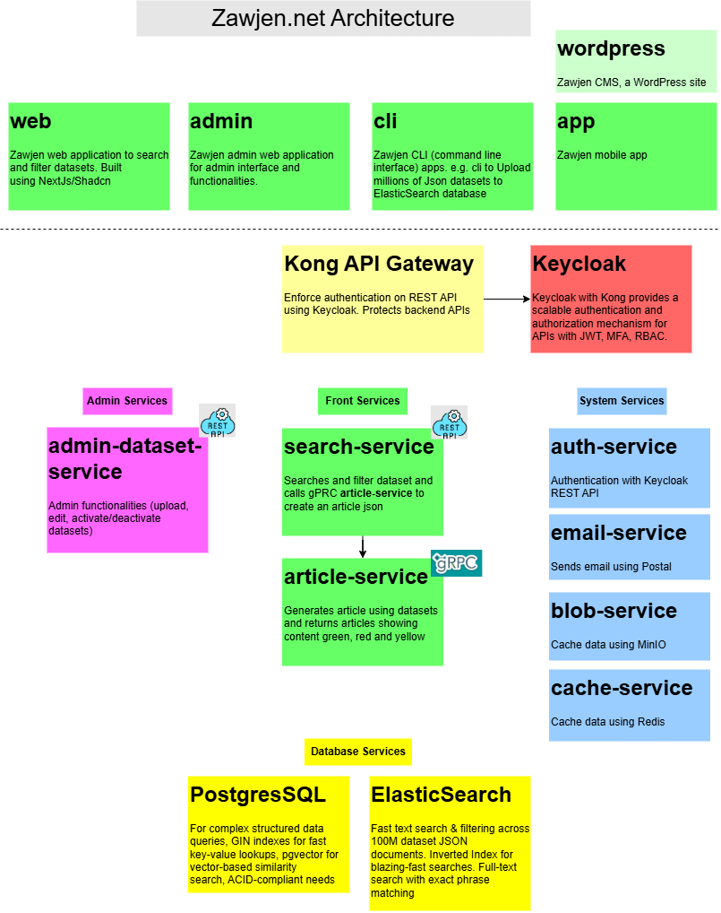

# Zawjen High Level Architecture
Document about Zawjen.net high level architecture

## Architecture Diagrams

# Modules
Following are the major modules of Zawjen:

- [web](web.md) - Zawjen web application to search and filter datasets.  
- [admin](admin.md) - Zawjen admin web application for admin interface and functionalities.  
- [app](app.md) - Zawjen mobile app.  
- [services](services.md) - Zawjen backend services and REST/gRPC APIs.  
- [cli](cli.md) - Zawjen CLI (command line interface) apps.  
- [infra](infra.md) - Zawjen infrastructure, deployment, and DevOps modules.  
- [wordpress](wordpress.md) - Zawjen CMS, a WordPress site.

