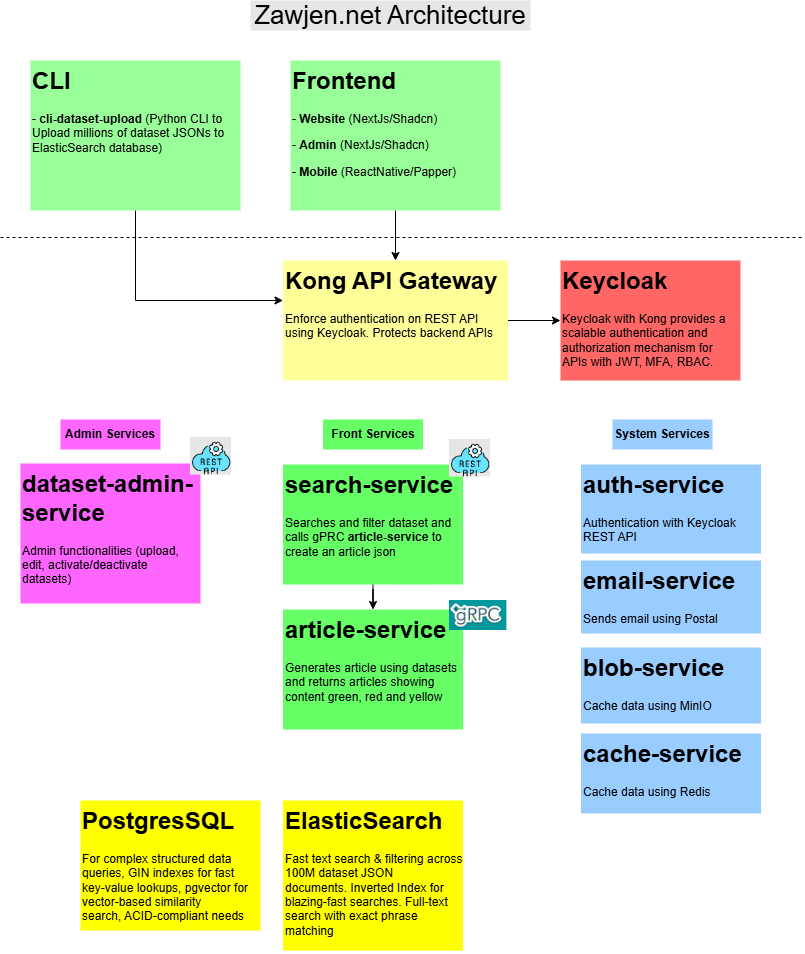

# System HLA - High Level Architecture
Document about Zawjen.net high level architecture

## Architecture Diagrams

## Tech Stack
Following Tech Stack will be used:

1. Zawjen.net will be developed using NextJs and Shadcn due to data, search, filter, SEO, content heavy website with billions of pages like medium.com or wikipedia.com
2. For zawjen admin website we will use same NextJs and Shadcn
3. For zawjen mobile app we will use React native and papper
4. TypeScript everywhere
5. Jest for unit test
6. NestJs Node for backend APIs
7. GitHub api-contract repo for Postman REST API request response JSON, QA automation, frontend testing, backend testing, API documentation, automatic authentication 
8. Kuberneets for service clustering
9. GitHub project for tickets assignment 
10. Markdown to write requirements 
11. OKR and Scrum as process
12. Google Meet for screen sharing calls
13. GitHub organization repo to define engineering and non engineering processes
14. GitHub project to report bugs
15. Kong API Gateway

## NextJs Rational

- NextJs now seems very natural and logical choice because of SEO, SSR, CSR

## Shadcn Rational

- We will be using Shadcn due to its performance and minimalist design.

## NestJS Rational

For our use case of billions of requests, performance and testibility we have to consider a few things.

When comparing Express.js and NestJS for REST API development, considering performance, scalability, and testability is crucial. Express.js is a lightweight, unopinionated framework that offers maximum flexibility and is ideal for small to medium projects where simplicity and speed matter. However, as applications grow, managing scalability, structure, and maintainability becomes challenging. NestJS, built on top of Express (or Fastify for better performance), provides a modular and opinionated architecture, built-in dependency injection, TypeScript support, and native microservices compatibility, making it better suited for large-scale applications.

From a performance standpoint, Express has lower overhead and is slightly faster for simple APIs, but NestJS with Fastify can outperform it while retaining a well-structured framework. In terms of testability, NestJS has a significant advantage—it comes with built-in support for unit testing, integration testing, and dependency injection, making it easier to mock dependencies and write isolated, maintainable tests using Jest or other testing frameworks. Express, being unopinionated, requires additional setup and third-party libraries for proper test coverage.

Overall, if you need a quick and flexible solution, Express is great, but for scalability, maintainability, built-in testability, and enterprise-grade APIs, NestJS is the better choice.

Here's a detailed comparison table between **NestJS** and **Express.js** across various benchmarks:  

| Benchmark              | **NestJS**                                       | **Express.js**                                   |
|------------------------|------------------------------------------------|------------------------------------------------|
| **Cost**               | Higher initial cost due to structure & learning curve | Lower initial cost, faster to start & deploy |
| **Performance**        | Slightly slower due to extra abstractions but scalable | Faster in lightweight apps, can be optimized |
| **Testability**        | High – built-in DI (Dependency Injection) makes testing easier | Lower – requires manual setup for DI and testing |
| **Developer Experience** | Better for large-scale apps with TypeScript, DI, and modularity | Simple and flexible but can get messy in large projects |
| **Feature Rich**       | Comes with built-in features like validation, interceptors, middleware, WebSockets | Minimalistic – requires third-party packages for advanced features |
| **Time to Deliver Fast** | Slower at first due to structure & learning curve but faster in the long run | Faster initially but can slow down in large apps due to lack of structure |
| **Scalability**        | Highly scalable – follows modular architecture with DI | Scalable but needs extra structuring effort |
| **Community Support**  | Strong, growing community, backed by Angular team | Very strong, longest-running Node.js framework |
| **Microservices Support** | Built-in support for microservices, GraphQL, gRPC, etc. | Needs additional setup for microservices |
| **Learning Curve**     | Steeper due to TypeScript, DI, and architecture | Easier to learn – simple routing and middleware |
| **Security**           | Built-in guards, interceptors, validation, and role-based access control | Needs additional middleware & manual security implementation |
| **Use Case**          | Ideal for enterprise, large-scale, and microservices applications | Best for small to medium projects, quick prototypes |
| **Maintenance**       | Easier due to structured approach, clear architecture | Can be difficult to maintain if structure is not planned well |

### **Conclusion**  
- **Choose NestJS** if you need **scalability, maintainability, and built-in features**. Best for **large-scale applications, enterprise solutions, and microservices**.  
- **Choose Express.js** if you want **lightweight, high-performance, and quick prototyping**. Best for **small to medium applications and startups**.  

# Reusability

Create folders and reusable classes in such a way under sdk folder or as npm packages so that they can be unit tested independently and can be reused in

1. Zawjen
2. Zawjen admin 
3. Zawjen mobile app
4. More apps and websites in future

# Unit Test
We will heavily write unit tests using Jest and integration tests using playwright. We will test everywhere web, mobile, frontend and backend.

PR without 100% coverage will not be accepted.

# Lint

- Typescript liniting using ESlint